# Besiege-GameData
`jskyzer` `2019/02/17`

backup for besiege gamedata (savedata and config) and design model.

+ What is Besiege

> From [Steam](https://store.steampowered.com/app/346010/Besiege/)
>
> Besiege is a physics based building game in which you construct medieval siege engines and lay waste to immense fortresses and peaceful hamlets. Build a machine which can crush windmills, wipe out battalions of brave soldiers and transport valuable resources, defending your creation against cannons, archers and whatever else the desperate enemies have at their disposal. Create a trundling behemoth, or take clumsily to the skies, and cause carnage in fully destructible environments. Ultimately, you must conquer every Kingdom by crippling their castles and killing their men and livestock, in as creative or clinical a manner as possible!
>
> Besiege 是一款以物理学为基础的建造游戏。您可以在游戏里建造中世纪的攻城机械，将巨型堡垒及宁静村落夷为废墟。 建造一台大型机械来粉碎架架风车，剿灭勇武士兵，运送宝贵资源，抵御孤注一掷的敌人的弓箭利炮以及所能调动的其他一切力量，来保护您的心血之作。 创造一个轰隆前行的庞然大物，或是翱翔蓝天，攻城掠地，大开杀戒。 最后，您必须用最具创造力、最冷酷无情的方式，摧毁城堡，杀他个片甲不留，征服每个王国！

+ Design model Preview

my game model list below

Special thanks to this [walkthrough](https://steamcommunity.com/sharedfiles/filedetails/?id=905422510)

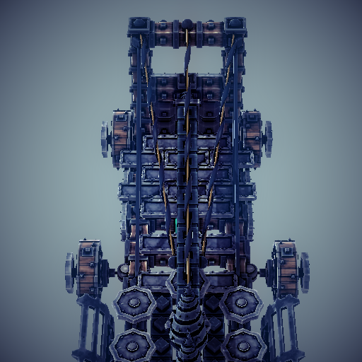

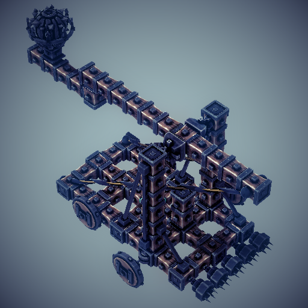

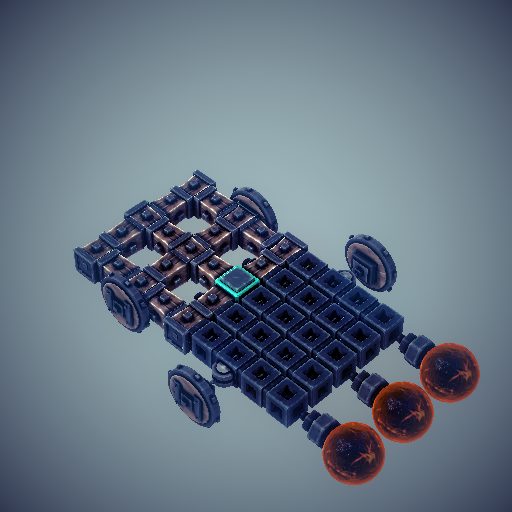

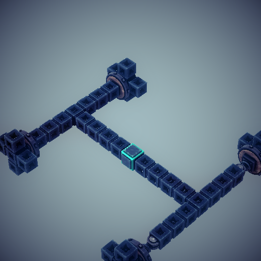

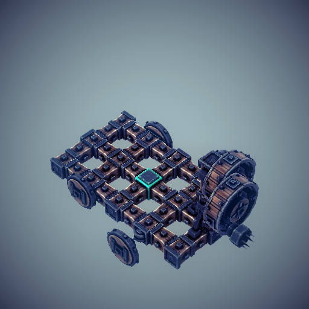

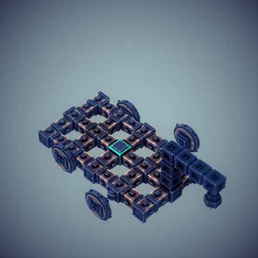

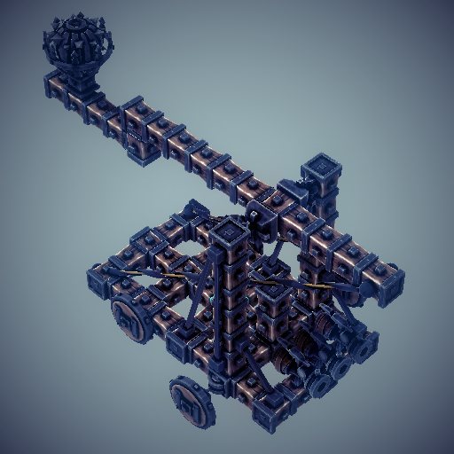

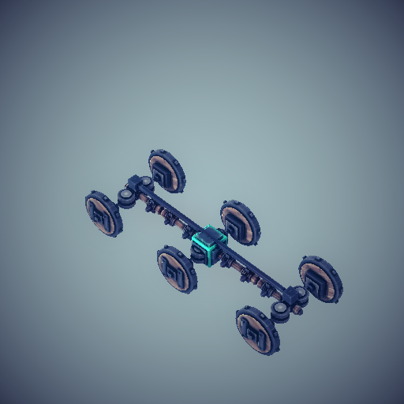

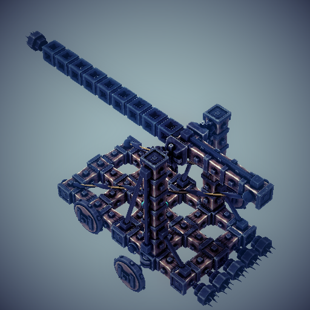

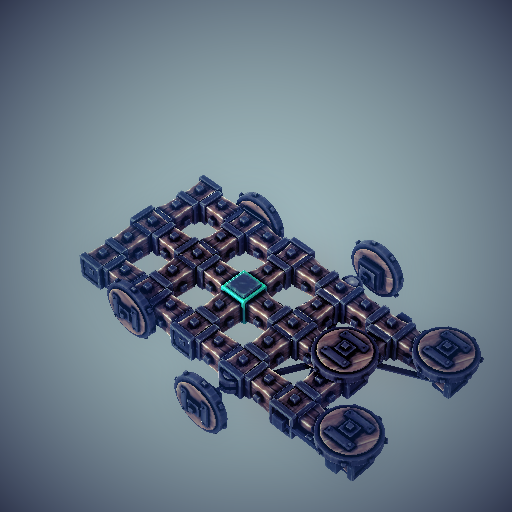

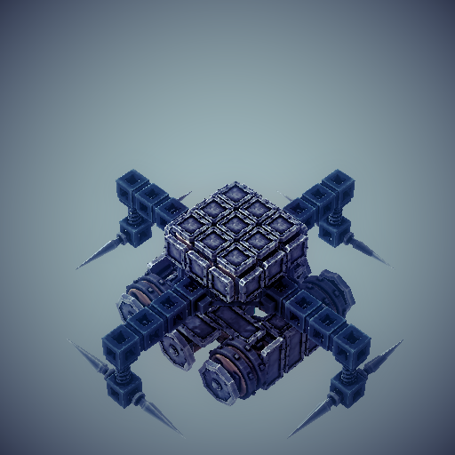

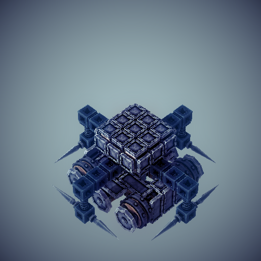

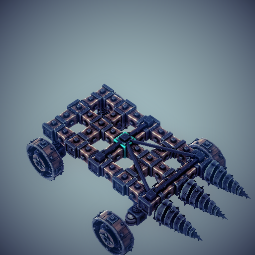

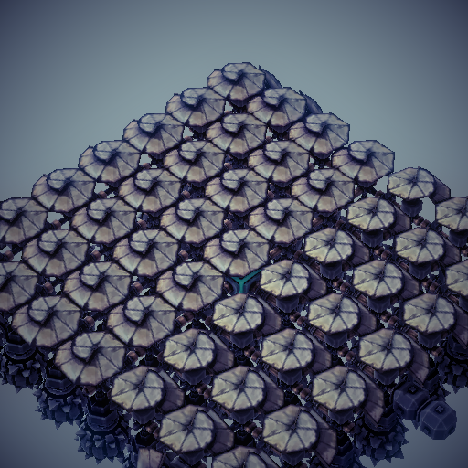

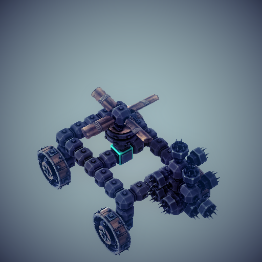

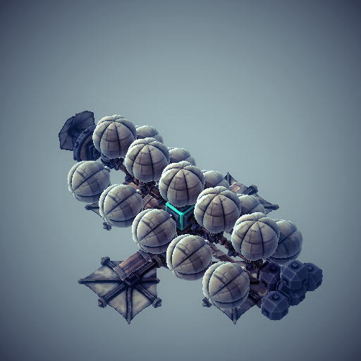

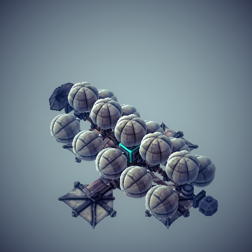

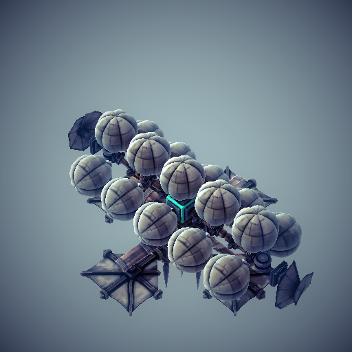

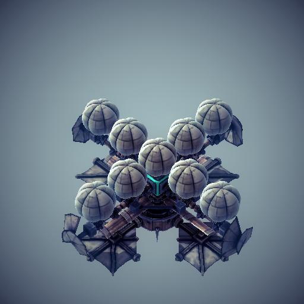

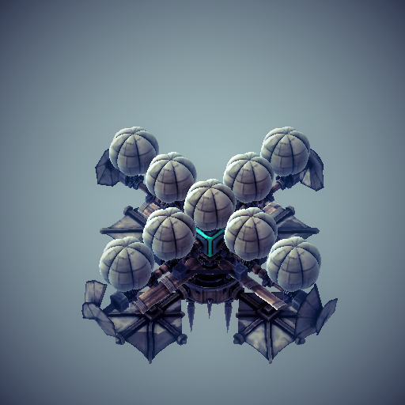

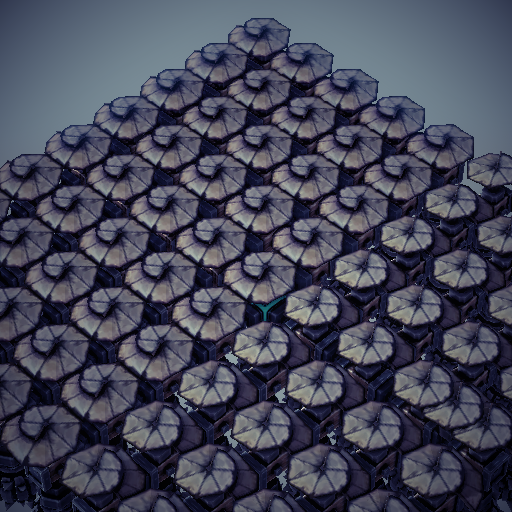

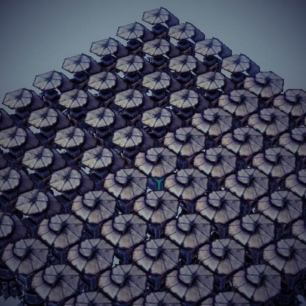

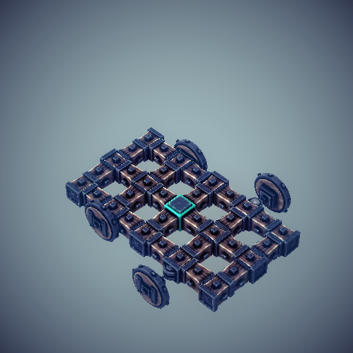

